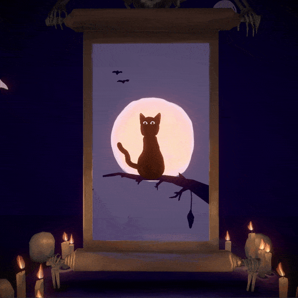
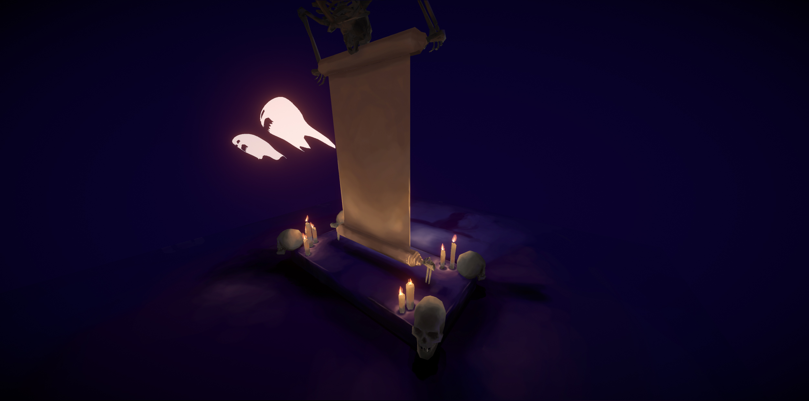
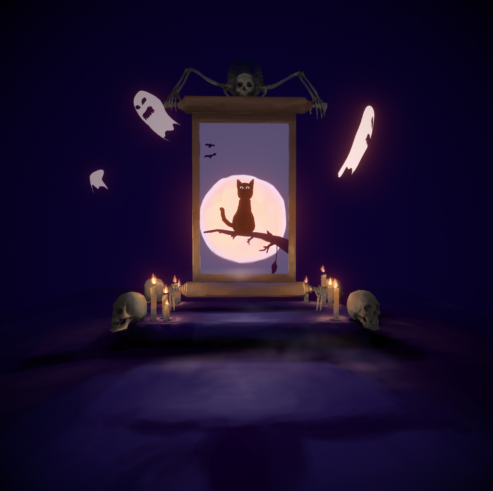
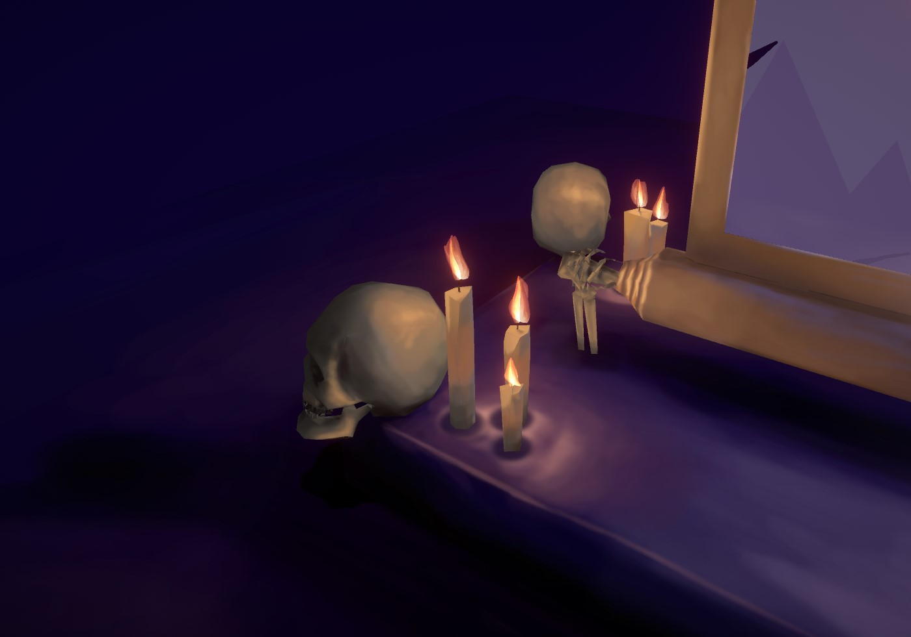

Stencil Portals Made in Unity 3D
=================
Code for a series of tech art tricks making my halloween special scene. I do a break down of all the techniques here:  https://medium.com/@shahriyarshahrabi/stencil-portal-in-unity-vfx-breakdown-3dd76b60ad07

In the break down I go over:
- setting up a stencil portal
- dealing with render order issues
- mixing baked and procedural animation
- stylized ghosts
- volumetric fog with lighting
- flames
- Modeling and texturing of the scene.

More Screen shots: 

